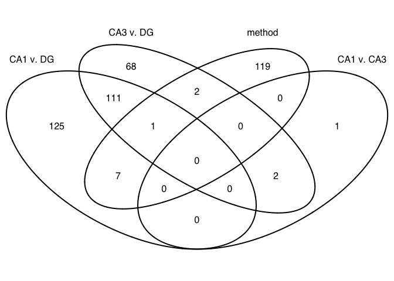

Methods for Dorsal Hippocampal Gene Expression Profiling
--------------------------------------------------------

#### Part 1: Examining the influence of dissasociation on gene expression in the CA1, CA3, and DG

Subset to just look homogenized and dissociated samples
-------------------------------------------------------

    colData <- colData %>%
      filter(Mouse %in% c("15-100")) %>% droplevels()
    savecols <- as.character(colData$RNAseqID) #selects all good samples
    savecols <- as.vector(savecols) # make it a vector
    countData <- countData %>% select(one_of(savecols)) # keep good samples

This PCA gives an overview of the variability between samples using the
a large matrix of log transformed gene expression data. You can see that
the bigges difference is between DG punches and the CA1 and CA3 punches.
CA1 and CA3 samples have similar transcriptomes. The homogenized CA1
samples have the most similar transcriptonal profiles as evidenced by
their tight clustering.

This Venn Diagram shows the number of differentially expressed by
contrast described above each oval. The most number of genes are
differntially expressed between DG and the CAs (nearly 1000) wheras only
about 200 were differntailly regulated as a result of of technical
maniplulation comparing homogenized and dissociated samples.

Here, the goal is the analyze the distribution of pvalues to see if they
are randomly distributed or if that is a tendency towards and increase
or decrease of low pvalues. There, I'm showing the pval and adjusted
pvale (padj) for all for two-way comparision.

    head(rldpvals)

    ##               pvalPunchCA1DG padjPunchCA1DG pvalPunchCA3DG padjPunchCA3DG
    ## 0610007P14Rik     0.56823853      1.0000000     0.74481477      0.9823162
    ## 0610009B22Rik     0.64786125      1.0000000     0.45021525      0.9288071
    ## 0610009L18Rik     0.01596479      0.3019016     0.04667271      0.5130170
    ## 0610009O20Rik     0.97898532      1.0000000     0.74979209      0.9836092
    ## 0610010F05Rik     0.61887935      1.0000000     0.56833596      0.9294782
    ## 0610010K14Rik     0.50933468      1.0000000     0.05782676      0.5562383
    ##               pvalPunchCA1CA3 padjPunchCA1CA3
    ## 0610007P14Rik       0.2833914               1
    ## 0610009B22Rik       0.7017419               1
    ## 0610009L18Rik       0.6256568               1
    ## 0610009O20Rik       0.7142028               1
    ## 0610010F05Rik       0.9220665               1
    ## 0610010K14Rik       0.1486267               1
    ##               pvalmethodhomogenizeddissociated
    ## 0610007P14Rik                        0.5375223
    ## 0610009B22Rik                        0.8919044
    ## 0610009L18Rik                        0.7574899
    ## 0610009O20Rik                        0.5562629
    ## 0610010F05Rik                        0.6300083
    ## 0610010K14Rik                        0.8105541
    ##               padjmethodhomogenizeddissociated
    ## 0610007P14Rik                         0.999948
    ## 0610009B22Rik                         0.999948
    ## 0610009L18Rik                         0.999948
    ## 0610009O20Rik                         0.999948
    ## 0610010F05Rik                         0.999948
    ## 0610010K14Rik                         0.999948

    rldpvalslong <- rldpvals
    rldpvalslong$gene <- row.names(rldpvalslong) 
    rldpvalslong <- melt(rldpvalslong, id=c("gene"))
    head(rldpvalslong)

    ##            gene       variable      value
    ## 1 0610007P14Rik pvalPunchCA1DG 0.56823853
    ## 2 0610009B22Rik pvalPunchCA1DG 0.64786125
    ## 3 0610009L18Rik pvalPunchCA1DG 0.01596479
    ## 4 0610009O20Rik pvalPunchCA1DG 0.97898532
    ## 5 0610010F05Rik pvalPunchCA1DG 0.61887935
    ## 6 0610010K14Rik pvalPunchCA1DG 0.50933468

    qplot(value, data=rldpvalslong, geom="histogram") + 
      facet_grid( ~ variable) +
      scale_y_log10()

    ## `stat_bin()` using `bins = 30`. Pick better value with `binwidth`.

    ## Warning: Removed 72 rows containing non-finite values (stat_bin).

    ## Warning: Stacking not well defined when ymin != 0

I'm not really happy with these two heat maps. Here's how I created
them. Top heatmap: subset the data to give only the gene with an
adjusted p value &lt; 0.05 for the homogenized vs dissociated
comparisonany two-way comparsion. Bottom heatmap: subset the data to
give only the gene with an adjusted p value &lt; 0.05 for two way brain
region comparision (CA1 vs DG, CA3, vs DG, or CA1 vs DG)

Here, you can see that the differences between samples is not as clear
cut for all comparisions. What other mechanisms would be useful for
subseting the data to identify genes of interest?

This is a data validation check plot. Here, I'm showing how many
millions of reads were present in each sample. On average, each sample
had 5 million reads, but the range was from 0.8 to 10 millino reads.

    FALSE [1] 22485    14

    FALSE 100-CA1-1 100-CA1-2 100-CA1-3 100-CA3-1 100-CA3-4  100-DG-2  100-DG-3 
    FALSE  1.136597  3.311998  1.114747  0.966391  1.205348  0.658410  3.055740 
    FALSE 101-CA1-1 101-CA1-2 101-CA1-3 101-CA3-1 101-CA3-4  101-DG-3  101-DG-4 
    FALSE  2.668415  0.072040  0.154427  1.361076  0.639942  0.036498  0.300618

    FALSE 
    FALSE    0    1    2    3    4    5    6    7    8    9   10   11   12   13   14 
    FALSE 5353  455  405  314  258  226  229  158  160  147  149  131  110  121  116 
    FALSE   15   16   17   18   19   20   21   22   23   24   25   26   27   28   29 
    FALSE   96   91   81   84   80   82   82   73   67   68   68   62   56   60   68

These next graphs show the correlation between samples of CA1, CA3, and
DG.

This next plot shows the stregnth of the correlation between samples.

Save files for GO analysis. A total of 217 DEGs with unadjusted p-value
&lt; 0.1 were input into the GO anlaysis.
