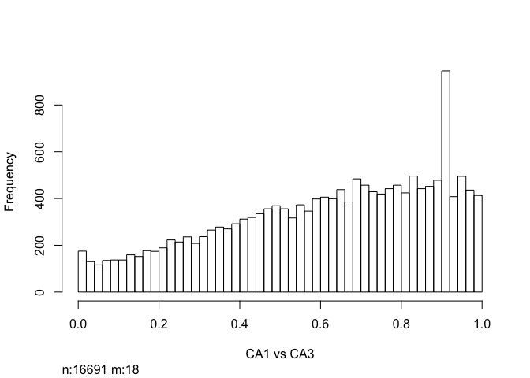
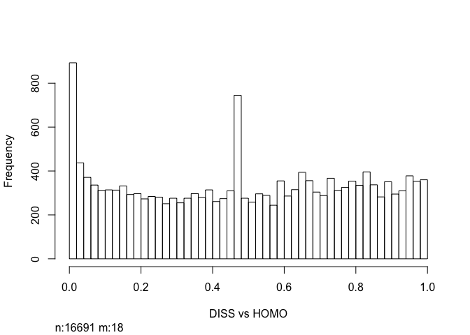

Examining Factors that influence dorsal hippocampal gene expression profiling
-----------------------------------------------------------------------------

In this analysis, I examine the effect that cells dissasociation has on
CA1, CA3, and DG gene expression relative to homogenized tissue samples.

Here is a brief overview of the samples being compared.

    str(colData)

    ## 'data.frame':    14 obs. of  14 variables:
    ##  $ RNAseqID : Factor w/ 14 levels "100-CA1-1","100-CA1-2",..: 1 2 3 4 5 6 7 8 9 10 ...
    ##  $ Mouse    : Factor w/ 1 level "15-100": 1 1 1 1 1 1 1 1 1 1 ...
    ##  $ year     : int  2015 2015 2015 2015 2015 2015 2015 2015 2015 2015 ...
    ##  $ Genotype : Factor w/ 1 level "WT": 1 1 1 1 1 1 1 1 1 1 ...
    ##  $ jobnumber: Factor w/ 1 level "JA16444": 1 1 1 1 1 1 1 1 1 1 ...
    ##  $ Region   : Factor w/ 3 levels "CA1","CA3","DG": 1 1 1 2 2 3 3 1 1 1 ...
    ##  $ Group    : Factor w/ 1 level "homecage": 1 1 1 1 1 1 1 1 1 1 ...
    ##  $ Conflict : Factor w/ 0 levels: NA NA NA NA NA NA NA NA NA NA ...
    ##  $ APA      : Factor w/ 0 levels: NA NA NA NA NA NA NA NA NA NA ...
    ##  $ Method   : Factor w/ 2 levels "control","dissociated": 1 1 1 1 1 1 1 2 2 2 ...
    ##  $ dodgy    : Factor w/ 1 level "allgood": 1 1 1 1 1 1 1 1 1 1 ...
    ##  $ daytime  : Factor w/ 1 level "norecord": 1 1 1 1 1 1 1 1 1 1 ...
    ##  $ Slice    : int  1 2 3 1 4 2 3 1 2 3 ...
    ##  $ Date     : Factor w/ 1 level "9/28/15": 1 1 1 1 1 1 1 1 1 1 ...

    summary(colData)

    ##       RNAseqID    Mouse         year      Genotype   jobnumber  Region 
    ##  100-CA1-1:1   15-100:14   Min.   :2015   WT:14    JA16444:14   CA1:6  
    ##  100-CA1-2:1               1st Qu.:2015                         CA3:4  
    ##  100-CA1-3:1               Median :2015                         DG :4  
    ##  100-CA3-1:1               Mean   :2015                                
    ##  100-CA3-4:1               3rd Qu.:2015                                
    ##  100-DG-2 :1               Max.   :2015                                
    ##  (Other)  :8                                                           
    ##       Group    Conflict    APA             Method      dodgy   
    ##  homecage:14   NA's:14   NA's:14   control    :7   allgood:14  
    ##                                    dissociated:7               
    ##                                                                
    ##                                                                
    ##                                                                
    ##                                                                
    ##                                                                
    ##      daytime       Slice            Date   
    ##  norecord:14   Min.   :1.000   9/28/15:14  
    ##                1st Qu.:1.250               
    ##                Median :2.500               
    ##                Mean   :2.429               
    ##                3rd Qu.:3.000               
    ##                Max.   :4.000               
    ## 

This PCA gives an overview of the variability between samples using the
a large matrix of log transformed gene expression data. You can see that
the bigges difference is between DG punches and the CA1 and CA3 punches.
CA1 and CA3 samples have similar transcriptomes. The homogenized CA1
samples have the most similar transcriptonal profiles as evidenced by
their tight clustering.

Now, we can calulate the number of significant genes by contrast by
contrast. The first number displayed is not corrected for mutiple
hypothesis testing but the second one is.

    ## DEG by contrasts
    source("resvalsfunction.R")
    contrast1 <- resvals(contrastvector = c('Region', 'CA1', 'DG'), mypval = 0.1)

    ## [1] 1723
    ## [1] 281

    contrast2 <- resvals(contrastvector = c('Region', 'CA3', 'DG'), mypval = 0.1)

    ## [1] 903
    ## [1] 46

    contrast3 <- resvals(contrastvector = c('Region', 'CA1', 'CA3'), mypval = 0.1)

    ## [1] 551
    ## [1] 5

    contrast4 <- resvals(contrastvector = c('Method', 'control', 'dissociated'), mypval = 0.1)

    ## [1] 1662
    ## [1] 129

Now, we can view a histogram of the distribution

    ## [1] 1

    ## [1] 1

    ## [1] 1

    ## [1] 1

This Venn Diagram sthe overlap of differentailly expression genes by
Region and method. This shows all genes with *uncorrected* pvalue
&lt;0.1.

This Venn Diagram sthe overlap of differentailly expression genes by
Region and method. This shows all genes with *adjusted* pvalue &lt;0.1.

I'm not really happy with these two heat maps. Here's how I created
them. Top heatmap: subset the data to give only the gene with an
adjusted p value &lt; 0.05 for the homogenized vs dissociated
comparisonany two-way comparsion. Bottom heatmap: subset the data to
give only the gene with an adjusted p value &lt; 0.05 for two way brain
region comparision (CA1 vs DG, CA3, vs DG, or CA1 vs DG)

Here, you can see that the differences between samples is not as clear
cut for all comparisions. What other mechanisms would be useful for
subseting the data to identify genes of interest?

This shows how strongly correlated the samples are. Even across brain
regions, correlation is super fucking hight.

This is a data validation check plot. Here, I'm showing how many
millions of reads were present in each sample. On average, each sample
had 5 million reads, but the range was from 0.8 to 10 millino reads.

    FALSE [1] 22485    14

    FALSE 100-CA1-1 100-CA1-2 100-CA1-3 100-CA3-1 100-CA3-4  100-DG-2  100-DG-3 
    FALSE  1.136597  3.311998  1.114747  0.966391  1.205348  0.658410  3.055740 
    FALSE 101-CA1-1 101-CA1-2 101-CA1-3 101-CA3-1 101-CA3-4  101-DG-3  101-DG-4 
    FALSE  2.668415  0.072040  0.154427  1.361076  0.639942  0.036498  0.300618

    FALSE 
    FALSE    0    1    2    3    4    5    6    7    8    9   10   11   12   13   14 
    FALSE 5353  455  405  314  258  226  229  158  160  147  149  131  110  121  116 
    FALSE   15   16   17   18   19   20   21   22   23   24   25   26   27   28   29 
    FALSE   96   91   81   84   80   82   82   73   67   68   68   62   56   60   68

Save files for GO analysis. A total of 217 DEGs with unadjusted p-value
&lt; 0.1 were input into the GO anlaysis.
