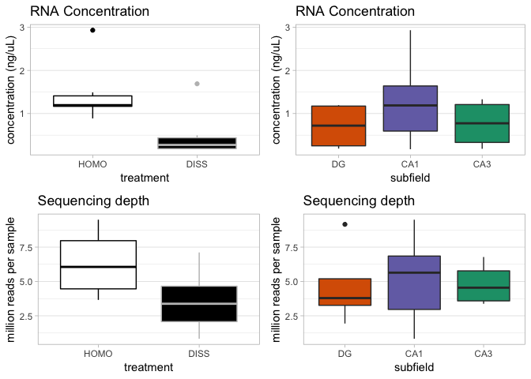

    library(tidyverse)

    ## ── Attaching packages ──────────────────────────────────────── tidyverse 1.2.1 ──

    ## ✔ ggplot2 3.0.0     ✔ purrr   0.2.5
    ## ✔ tibble  1.4.2     ✔ dplyr   0.7.6
    ## ✔ tidyr   0.8.2     ✔ stringr 1.3.1
    ## ✔ readr   1.1.1     ✔ forcats 0.3.0

    ## ── Conflicts ─────────────────────────────────────────── tidyverse_conflicts() ──
    ## ✖ dplyr::filter() masks stats::filter()
    ## ✖ dplyr::lag()    masks stats::lag()

    library(cowplot)

    ## 
    ## Attaching package: 'cowplot'

    ## The following object is masked from 'package:ggplot2':
    ## 
    ##     ggsave

    knitr::opts_chunk$set(fig.path = '../figures/06_readcounts/')

Thankfully, the Genome Sequencing and Analysis Facility maintaines
friendly webarchive of sample information long after samples are
processed. This included a table of reads per sample and any quality
conrol data.

RNA concentation in each sample
-------------------------------

    rnaconcentration <- read.csv("../results/picogreen.csv")
    summary(rnaconcentration)

    ##        sample    picograms      treatment subfield
    ##  100-CA1-1:1   Min.   : 173.0   DISS:7    CA1:6   
    ##  100-CA1-2:1   1st Qu.: 299.8   HOMO:7    CA3:4   
    ##  100-CA1-3:1   Median :1026.5             DG :4   
    ##  100-CA3-1:1   Mean   : 967.6                     
    ##  100-CA3-4:1   3rd Qu.:1296.0                     
    ##  100-DG-2 :1   Max.   :2931.0                     
    ##  (Other)  :8

    # format data
    rnaconcentration$nanograms <- (rnaconcentration$picograms)/1000 
    rnaconcentration$treatment <- factor(rnaconcentration$treatment, levels = c("HOMO", "DISS"))
    rnaconcentration$subfield <- factor(rnaconcentration$subfield, levels = c("DG", "CA1", "CA3"))

    a <- ggplot(rnaconcentration, 
                aes(x = treatment, y = nanograms, 
                    fill = treatment, color = treatment)) + 
      geom_boxplot() +
      scale_fill_manual(values = c("white", "black")) +
      scale_color_manual(values = c("black", "grey")) +
      theme_cowplot(font_size = 12, line_size = 0.25) +
      labs(y = "concentration (ng/uL)",
           title = "RNA Concentration") +
      theme_light() +
        theme(legend.position = "none",
              panel.grid.major.x = element_blank()) 

    b <- ggplot(rnaconcentration, aes(x = subfield, y = nanograms, 
                      fill = subfield)) + 
      geom_boxplot() +
      scale_fill_manual(values = c("#d95f02", "#7570b3", "#1b9e77" )) +
      theme_cowplot(font_size = 12, line_size = 0.25) +
      labs(y = "concentration (ng/uL)",
           title = "RNA Concentration") +
      theme_light() +
        theme(legend.position = "none",
              panel.grid.major.x = element_blank())

    homo <- rnaconcentration %>% filter(treatment == "HOMO") 
    mean(homo$nanograms)

    ## [1] 1.452143

    sd(homo$nanograms)

    ## [1] 0.6772413

    diss <- rnaconcentration %>% filter(treatment == "DISS") 
    mean(diss$nanograms)

    ## [1] 0.4831429

    sd(diss$nanograms)

    ## [1] 0.5450442

    summary(aov(nanograms ~ subfield * treatment, data=rnaconcentration))

    ##                    Df Sum Sq Mean Sq F value Pr(>F)  
    ## subfield            2  1.015   0.508   1.154 0.3627  
    ## treatment           1  3.286   3.286   7.472 0.0257 *
    ## subfield:treatment  2  0.001   0.000   0.001 0.9992  
    ## Residuals           8  3.518   0.440                 
    ## ---
    ## Signif. codes:  0 '***' 0.001 '**' 0.01 '*' 0.05 '.' 0.1 ' ' 1

Counts per Sample
-----------------

Counts per sample is provided by the GSAF. Alternatively, you can use
this bash forloop to count the reads yourself.

    for file in *R1_001.fastq.gz
    do
    echo $file
    zcat $file | echo $((`wc -l`/4)) 
    done 

A table of sample and read counts was save in
`../results/readcounts.txt`.

    reads <- read.table("../results/readcounts.txt", header = T)
    summary(reads)

    ##         name       counts        treatment subfield
    ##  100_CA1_1:1   Min.   : 831222   DISS:7    CA1:6   
    ##  100_CA1_2:1   1st Qu.:3447633   HOMO:7    CA3:4   
    ##  100_CA1_3:1   Median :4547688             DG :4   
    ##  100_CA3_1:1   Mean   :4918879                     
    ##  100_CA3_4:1   3rd Qu.:6600756                     
    ##  100_DG_2 :1   Max.   :9496400                     
    ##  (Other)  :8

    # format data
    reads$millionreads <- (reads$counts)/1000000 # to show in millions
    reads$treatment <- factor(reads$treatment, levels = c("HOMO", "DISS"))
    reads$subfield <- factor(reads$subfield, levels = c("DG", "CA1", "CA3"))

    # stats
    mean(reads$millionreads) 

    ## [1] 4.918879

    sd(reads$millionreads)

    ## [1] 2.606619

    c <- ggplot(reads, aes(x = treatment, y = millionreads, 
                      fill = treatment, color = treatment)) + 
      geom_boxplot() +
      scale_fill_manual(values = c("white", "black")) +
      scale_color_manual(values = c("black", "grey")) +
      theme_cowplot(font_size = 12, line_size = 0.25) +
      labs(y = "million reads per sample",
           title = "Sequencing depth") +
      theme_light() +
        theme(legend.position = "none",
              panel.grid.major.x = element_blank()) 

    d <- ggplot(reads, aes(x = subfield, y = millionreads, 
                      fill = subfield)) + 
      geom_boxplot() +
      scale_fill_manual(values = c("#d95f02", "#7570b3", "#1b9e77" )) +
      theme_cowplot(font_size = 12, line_size = 0.25) +
      labs(y = "million reads per sample",
           title = "Sequencing depth") +
      theme_light() +
        theme(legend.position = "none",
              panel.grid.major.x = element_blank())

    homo <- reads %>% filter(treatment == "HOMO") 
    mean(homo$millionreads)

    ## [1] 6.297195

    sd(homo$millionreads)

    ## [1] 2.365091

    diss <- reads %>% filter(treatment == "DISS") 
    mean(diss$millionreads)

    ## [1] 3.540563

    sd(diss$millionreads)

    ## [1] 2.166776

    summary(aov(millionreads ~ subfield * treatment, data=reads))

    ##                    Df Sum Sq Mean Sq F value Pr(>F)  
    ## subfield            2   0.63   0.315   0.045 0.9560  
    ## treatment           1  26.60  26.597   3.812 0.0867 .
    ## subfield:treatment  2   5.29   2.645   0.379 0.6961  
    ## Residuals           8  55.81   6.976                 
    ## ---
    ## Signif. codes:  0 '***' 0.001 '**' 0.01 '*' 0.05 '.' 0.1 ' ' 1

On average, my samples yielded 4.9 +/- 2.6 million reads.

    plot_grid(a,b,c,d)

    aligned <- read.table("../results/pseudoaligned_clean.txt", header = T)

    aligned$percent <- (aligned$pseudoaligned / aligned$processed) * 100
    summary(aligned)

    ##    processed       pseudoaligned        percent      
    ##  Min.   : 313015   Min.   :  65987   Min.   : 5.419  
    ##  1st Qu.:1479506   1st Qu.: 748285   1st Qu.:49.000  
    ##  Median :2958364   Median :2128611   Median :70.112  
    ##  Mean   :3302250   Mean   :2324577   Mean   :61.233  
    ##  3rd Qu.:3434580   3rd Qu.:2464398   3rd Qu.:74.323  
    ##  Max.   :8513137   Max.   :6653688   Max.   :79.540

    mean(aligned$percent)

    ## [1] 61.23341

    sd(aligned$percent)

    ## [1] 20.84956

On average, 61.2% +/1 20.8% of the trimmed reads were psuedoaligned to
the transcriptome.

MultiQC
-------

Here are the results QC before and after filtering and trimming reads

Before 

After 
