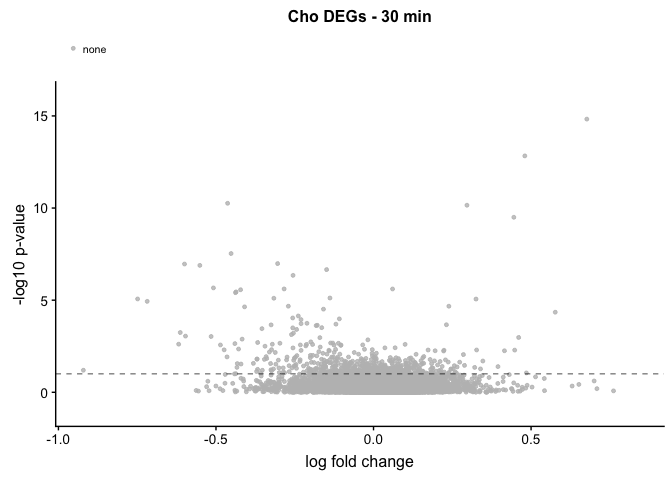
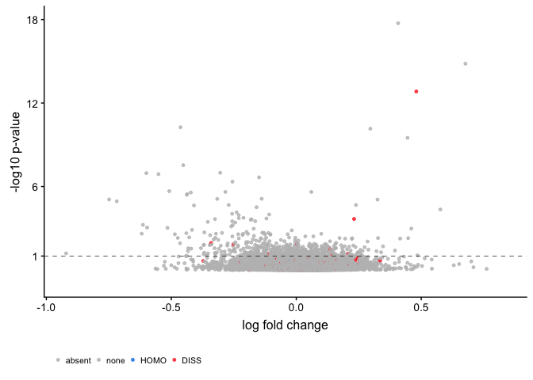

This script identifies to differntially expreseed genes from Cho et al.
(`../data/aac7368-Cho.SM.Table.S2.xls` from Andre Fenton) and asks if
there is any overlap in the the differentially expressed genes in their
study compared to mine.

### functions for data viz

    plotvolcano <- function(df, lfc, log10p, plottitle){
      ggplot(df, aes(x = lfc, y = log10p)) + 
      geom_point(aes(color = factor(direction)), size = 1, alpha = 0.8, na.rm = T) + 
      scale_x_continuous(name="log fold change") +
      scale_y_continuous(name="-log10 p-value",
                         breaks = c(0,5,10,15),
                         limits= c(-1,16)) +
      geom_hline(yintercept = 1,  size = 0.25, linetype = 2 ) +
      theme( legend.title = element_blank(),
             legend.position = "bottom",
             legend.text=element_text(size=7))  +
      scale_color_manual(values = c("none" = "grey",
                                    "fear-conditioned" = "#018571",
                                    "control" = "#a6611a")) + 
      labs(title = plottitle)
    }

    plotboxplot <- function(df, log10p, direction, plottitle){
      ggplot(df, aes(x = direction, y = log10p, colour = direction)) + 
      geom_boxplot() +
      theme( legend.title = element_blank(),
             legend.position = "bottom")  +
      scale_x_discrete(name="Upregulated in") +
      scale_y_continuous(name="-log10 p-value") +
      labs(title = plottitle) +
      geom_hline(yintercept = 1,  size = 0.25, linetype = 2 )
    } 
      
    # format Cho data for plotting and data frame joining
    wrangleCho <- function(df){
      data <- df  
      data$log10p <- -log10(data$pvalue) 
      data <- data %>% select(gene, lfc, log10p, pvalue, Description) %>%
        mutate(direction = ifelse(data$lfc > 0 & data$log10p > 1, 
                            yes = "fear-conditioned", 
                            no = ifelse(data$lfc < 0 & data$log10p > 1, 
                                        yes = "control", 
                                        no = "none")))
      data$direction <- as.factor(data$direction)
      data$direction <- factor(data$direction, c("control", "none", "fear-conditioned"))
      return(data)
    }

    top100overlap <- function(Chodataframe){
      df <- Chodataframe %>%
      filter(direction != "none")  %>%
      arrange(lfc) %>%
      tail(n=100)

      ij <- inner_join(df, dissociation, by = "gene")
      names(ij)[6] <- "Cho"
      names(ij)[10] <- "Harris"
      ij <-  ij %>% select(gene, Cho, Harris, log10p, Description) 
      
      return(ij)
    }

    # overlap with significance for each experiment
    overlap <- function(Chodataframe){
      df <- Chodataframe %>%
      #filter(direction != "none")  %>%
      arrange(lfc) 
      #tail(n=100)

      ij <- full_join(df, dissociation, by = "gene")
      names(ij)[6] <- "Cho"
      names(ij)[10] <- "Harris"
      #ij <-  ij %>% select(gene, Cho, Harris, log10p, lfc.x, Description) 
      ij$Harris <- as.character(ij$Harris)
      ij$Harris[is.na(ij$Harris)] <- "absent"
      #ij$Harris <- as.factor(ij$Harris)
      ij$Cho <- as.character(ij$Cho)
      ij$Cho[is.na(ij$Cho)] <- "absent"
      #ij$Cho <- as.factor(ij$Cho)
      
      ij$color <- ifelse(grepl("absent", ij$Harris), ij$Cho, 
                         ifelse(grepl("none", ij$Harris), ij$Cho,
                             ifelse(grepl("HOMO", ij$Harris), "HOMO",
                                    ifelse(grepl("DISS", ij$Harris), "DISS",
                                           NA))))
      ij$color <- as.factor(ij$color) 
      ij$color <- factor(ij$color, levels = c( "absent" , "none", 
                                             "control","fear-conditioned",
                                             "HOMO" , "DISS" ))
     #names(useful)
      
      return(ij)
    }

    ## suzy volcano
    suzyvolcano <- function(df, lfc, log10p, plottitle){
      ggplot(df, aes(x = lfc, y = log10p)) + 
      geom_point(aes(color = factor(color), size = factor(color)), 
                 alpha = 0.8, na.rm = T) +
      scale_size_manual(values=c(0.5, 0.5, 0.5, 0.5, 1, 1)) +
      scale_x_continuous(name="log fold change") +
      scale_y_continuous(name="-log10 p-value",
                         breaks = c(0,5,10,15),
                         limits= c(-1,16)) +
      geom_hline(yintercept = 1,  size = 0.25, linetype = 2 ) +
      theme( legend.title = element_blank(),
             legend.position = "bottom",
             legend.text=element_text(size=7))  +
      scale_color_manual(values = c("none" = "grey",
                                    "absent" = "grey",
                                    "HOMO" = "black",
                                    "DISS" = "red",
                                    "fear-conditioned" = "#018571",
                                    "control" = "#a6611a")) + 
      labs(title = plottitle)
    }

### Harris et al. data

    dissociation <- read.csv("../results/01_dissociation_volcanoTreatment.csv", 
                             header = T, row.names = 1)
    names(dissociation)[5] <- "direction"
    dissociation$direction <- factor(dissociation$direction, c("HOMO", "none", "DISS"))
    summary(dissociation$direction)

    ##  HOMO  none  DISS 
    ##    56 11813   288

    # differential gene expression in the harris data set
    dissociationDEGs <- dissociation %>% filter(direction != "none") 

### Cho et al. data at 4 hours

    S2 <- as.data.frame(readxl::read_excel("../data/aac7368-Cho.SM.Table.S2.xls", skip = 1 ))

    # RNA at 4 hours
    fourhoursRNA <- rename(S2, c(`RNA fold change (4 h/control), log2` ="lfc", 
                       `p-value (4 h)` = "pvalue",
                       `Gene Symbol` = "gene"))
    fourhoursRNA <- wrangleCho(fourhoursRNA)
    summary(fourhoursRNA$direction)

    ##          control             none fear-conditioned 
    ##              435            10503              593

    volcanoplot1 <- plotvolcano(fourhoursRNA, fourhoursRNA$lfc, fourhoursRNA$log10p, 
                                plottitle = "Cho DEGs - 4 h")

### Cho et al. data at 30 min

    # 30 min 
    S2 <- as.data.frame(readxl::read_excel("../data/aac7368-Cho.SM.Table.S2.xls", skip = 1 ))

    ## RNAseq at 30 min
    thirtyminRNA <- rename(S2, c(`RNA fold change (30 min/control), log2` ="lfc", 
                       `p-value (30 min)` = "pvalue",
                       `Gene Symbol` = "gene"))

    thirtyminRNA <- wrangleCho(thirtyminRNA)
    summary(thirtyminRNA$direction)

    ##          control             none fear-conditioned 
    ##              338            10932              261

    volcanoplot3 <- plotvolcano(thirtyminRNA, thirtyminRNA$lfc, thirtyminRNA$log10p, 
                                plottitle = "Cho DEGs - 30 min")

    plot_grid(volcanoplot1, volcanoplot3)

Plotting their data with my differential exprssion

    overlap30min <- overlap(thirtyminRNA)
    str(overlap30min)

    ## 'data.frame':    13127 obs. of  11 variables:
    ##  $ gene       : chr  "Cdkn1c" "Ltc4s" "Epn3" "1500015O10Rik" ...
    ##  $ lfc.x      : num  -0.921 -0.749 -0.718 -0.618 -0.613 ...
    ##  $ log10p     : num  1.2 5.07 4.94 2.61 3.24 ...
    ##  $ pvalue.x   : num  6.35e-02 8.58e-06 1.16e-05 2.45e-03 5.70e-04 ...
    ##  $ Description: chr  "cyclin-dependent kinase inhibitor 1C isoform 1" "leukotriene C4 synthase" "epsin-3" "augurin precursor" ...
    ##  $ Cho        : chr  "control" "control" "control" "control" ...
    ##  $ pvalue.y   : num  NA 0.939 NA NA NA ...
    ##  $ lfc.y      : num  NA 4.08 NA NA NA ...
    ##  $ padj       : num  NA 0.115 NA NA NA ...
    ##  $ Harris     : chr  "absent" "none" "absent" "absent" ...
    ##  $ color      : Factor w/ 6 levels "absent","none",..: 3 3 3 3 3 3 3 2 2 3 ...

    summary(overlap30min$color)

    ##           absent             none          control fear-conditioned 
    ##             1524            10676              334              249 
    ##             HOMO             DISS 
    ##               56              288

    overlap30min %>%
      filter(Cho == "control",
             Harris =="DISS")  %>%
      select(gene)

    ##      gene
    ## 1   Enpp2
    ## 2    Ucp2
    ## 3 Rps6kb2
    ## 4   Ltbp3

    overlap30min %>%
      filter(Cho == "fear-conditioned",
             Harris =="DISS")  %>%
      select(gene)

    ##      gene
    ## 1  Rpl36a
    ## 2  Stk32b
    ## 3  Csrnp1
    ## 4    Ctss
    ## 5    Cdh9
    ## 6   Ostf1
    ## 7     Fn1
    ## 8  Nfkbia
    ## 9   Dusp1
    ## 10   Btg2
    ## 11   Junb
    ## 12   Fosb

    suzyvolcano1 <- suzyvolcano(df = overlap30min, lfc = overlap30min$lfc.x, overlap30min$log10p, 
                                plottitle = "Cho 30 min and Harris DEGs")

    overlap4h <- overlap(fourhoursRNA)
    suzyvolcano2 <- suzyvolcano(overlap4h, overlap4h$lfc.x, overlap4h$lfc.x, 
                                plottitle = "Cho 4 hr and Harris DEGs")

    overlap4h %>%
      filter(Cho == "control",
             Harris =="DISS")  %>%
      select(gene)

    ##      gene
    ## 1   Enpp2
    ## 2    Ucp2
    ## 3    Cyba
    ## 4   Dusp1
    ## 5  Sh3d19
    ## 6   Pold1
    ## 7    Junb
    ## 8   Arl4c
    ## 9    Lcp1
    ## 10   Myrf
    ## 11  Crtc2

    overlap4h %>%
      filter(Cho == "fear-conditioned",
             Harris =="DISS")  %>%
      select(gene)

    ##      gene
    ## 1   Icam1
    ## 2   Lamb2
    ## 3    C1qb
    ## 4  Cldn11
    ## 5  Rps27a
    ## 6   Csf1r
    ## 7   Smoc2
    ## 8    C1qc
    ## 9   Rpl23
    ## 10   C1qa
    ## 11   Ctss
    ## 12 Slc2a1
    ## 13 Sema5a
    ## 14   Mobp
    ## 15  Pros1
    ## 16  Spry2
    ## 17 Selplg
    ## 18 Slc2a5
    ## 19   Plau
    ## 20    Fn1

All together again

    plot_grid(suzyvolcano2, suzyvolcano1, nrow = 1)

### Details

<https://www.ncbi.nlm.nih.gov/geo/query/acc.cgi?acc=GSE72064>

Genome-wide profilings of transcriptome and translatome in mouse
hippocampi after contextual fear conditioning

Memory stabilization after learning requires transcriptional and
translational regulations in the brain, yet the temporal molecular
changes following learning have not been explored at the genomic scale.
We here employed ribosome profiling and RNA sequencing to quantify the
translational status and transcript levels in mouse hippocampus
following contextual fear conditioning. We identified 104 genes that are
dynamically regulated. Intriguingly, our analysis revealed novel
repressive regulations in the hippocampus: translational suppression of
ribosomal protein-coding genes at basal state; learning-induced early
translational repression of specific genes; and late persistent
suppression of a subset of genes via inhibition of ESR1/ERα signaling.
Further behavioral analyses revealed that Nrsn1, one of the newly
identified genes undergoing rapid translational repression, can act as a
memory suppressor gene. This study unveils the yet unappreciated
importance of gene repression mechanisms in memory formation.
