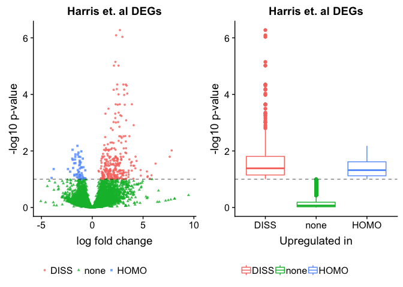
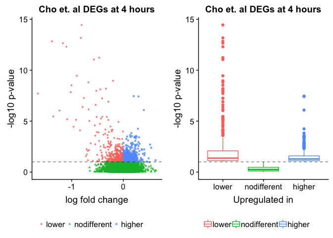
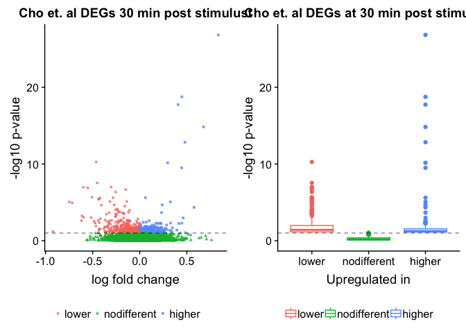

This script identifies to differntially expreseed genes from Cho et al.
(`../data/aac7368-Cho.SM.Table.S2.xls` from Andre Fenton) and asks if
there is any overlap in the the differentially expressed genes in their
study compared to mine.

    library(readxl)
    library(ggplot2)
    library(cowplot)
    library(dplyr)
    library(ggrepel)

    # set output file for figures 
    knitr::opts_chunk$set(fig.path = './figures/08-genelists/')

### functions for data viz

    plotvolcano <- function(df, lfc, log10p, plottitle){
      ggplot(df, aes(x = lfc, y = log10p)) + 
      geom_point(aes(color = factor(direction), 
                     shape = factor(direction)), 
                 size = 1, alpha = 0.8, na.rm = T) + 
      scale_x_continuous(name="log fold change") +
      scale_y_continuous(name="-log10 p-value") +
      geom_hline(yintercept = 1,  size = 0.25, linetype = 2 ) +
      theme( legend.title = element_blank(),
             legend.position = "bottom")  +
      labs(title = plottitle) 
    }

    plotboxplot <- function(df, log10p, direction, plottitle){
      ggplot(df, aes(x = direction, y = log10p, colour = direction)) + 
      geom_boxplot() +
      theme( legend.title = element_blank(),
             legend.position = "bottom")  +
      scale_x_discrete(name="Upregulated in") +
      scale_y_continuous(name="-log10 p-value") +
      labs(title = plottitle) 
    } 

### Harris et al. data

    dissociation <- read.csv("../results/01_dissociation_volcanoTreatment.csv", header = T, row.names = 1)
    names(dissociation)[5] <- "direction"
    names(dissociation)

    ## [1] "gene"      "pvalue"    "lfc"       "padj"      "direction"

    summary(dissociation$direction)

    ##  DISS  HOMO  none 
    ##   288    56 11813

    dissociation$direction <- factor(dissociation$direction, c("DISS", "none", "HOMO"))

    myboxplot <- plotboxplot(dissociation, dissociation$pvalue, 
                             plottitle = "Harris et. al DEGs")

    volcanoplot <- plotvolcano(dissociation, dissociation$lfc, dissociation$pvalue, plottitle = "Harris et. al DEGs")

    plot_grid(volcanoplot, myboxplot)

    # differential gene expression in the harris data set
    dissociation <- dissociation %>%
      filter(direction != "none") %>%
      arrange((padj))

### Cho et al. data at 4 hours

    S2 <- as.data.frame(readxl::read_excel("~/Downloads/aac7368-Cho.SM.Table.S2.xls", skip = 1 ))

    # the data for the 4 hour timepoint are in columns 10 and 14. ill rename them for easy
    names(S2)[10] <- "lfc"      
    names(S2)[14] <- "pvalue"   
    names(S2)[2] <- "gene"     # critical for joining dataframes later

    S2$log10p <- -log10(S2$pvalue) 

    data <- S2 %>% select(gene, lfc, log10p, pvalue, Description)

    data <- data %>%
      mutate(direction = ifelse(data$lfc > 0 & data$log10p > 1, 
                            yes = "higher", 
                            no = ifelse(data$lfc < 0 & data$log10p > 1, 
                                        yes = "lower", 
                                        no = "nodifferent")))
    data$direction <- as.factor(data$direction)
    data$direction <- factor(data$direction, c("lower", "nodifferent", "higher"))

    # show the number of DEGs at the 4 hour time point 
    summary(data$direction)

    ##       lower nodifferent      higher 
    ##         435       10503         593

    volcanoplot <- plotvolcano(data, data$lfc, data$log10p, plottitle = "Cho et. al DEGs at 4 hours")

    myboxplot <- plotboxplot(df = data, data$log10p, data$direction, "Cho et. al DEGs at 4 hours")

    plot_grid(volcanoplot, myboxplot)

### Overlaping DEGs between Harris et al. and Cho et al at 4 hours post treatment

    data <- data %>%
      filter(direction != "nodifferent")  %>%
      arrange(lfc)

    # show the overlap between the Harris and Cho DEGs at 4 hours
    ij <- inner_join(data, dissociation, by = "gene")

    ## Warning: Column `gene` joining character vector and factor, coercing into
    ## character vector

    names(ij)

    ##  [1] "gene"        "lfc.x"       "log10p"      "pvalue.x"    "Description"
    ##  [6] "direction.x" "pvalue.y"    "lfc.y"       "padj"        "direction.y"

    names(ij)[6] <- "Cho"
    names(ij)[10] <- "Harris"

    ij %>% select(gene, Cho, Harris, log10p) %>%
      arrange(Cho, Harris,log10p)

    ##        gene    Cho Harris   log10p
    ## 1      Ucp2  lower   DISS 1.035224
    ## 2      Lcp1  lower   DISS 1.039733
    ## 3     Arl4c  lower   DISS 1.050381
    ## 4     Crtc2  lower   DISS 1.052088
    ## 5      Cyba  lower   DISS 1.081165
    ## 6     Pold1  lower   DISS 1.316293
    ## 7     Dusp1  lower   DISS 1.330345
    ## 8      Myrf  lower   DISS 1.413227
    ## 9      Junb  lower   DISS 1.443716
    ## 10   Sh3d19  lower   DISS 1.856375
    ## 11    Enpp2  lower   DISS 4.584654
    ## 12     Ctss higher   DISS 1.097359
    ## 13    Csf1r higher   DISS 1.123621
    ## 14    Rpl23 higher   DISS 1.142111
    ## 15   Cldn11 higher   DISS 1.155499
    ## 16    Icam1 higher   DISS 1.161201
    ## 17     Plau higher   DISS 1.191287
    ## 18   Slc2a5 higher   DISS 1.212306
    ## 19     C1qa higher   DISS 1.213410
    ## 20    Pros1 higher   DISS 1.231081
    ## 21     C1qb higher   DISS 1.240421
    ## 22    Spry2 higher   DISS 1.255623
    ## 23    Lamb2 higher   DISS 1.321626
    ## 24   Sema5a higher   DISS 1.325216
    ## 25     Mobp higher   DISS 1.444639
    ## 26   Slc2a1 higher   DISS 1.447714
    ## 27   Selplg higher   DISS 1.556865
    ## 28    Smoc2 higher   DISS 1.573106
    ## 29     C1qc higher   DISS 1.837891
    ## 30   Rps27a higher   DISS 1.855251
    ## 31      Fn1 higher   DISS 3.416128
    ## 32    Epha6 higher   HOMO 1.035578
    ## 33   Gabrb1 higher   HOMO 1.041701
    ## 34 Ralgapa1 higher   HOMO 1.066870
    ## 35   Celsr2 higher   HOMO 1.340440
    ## 36    Sorl1 higher   HOMO 1.412081
    ## 37    Adcy9 higher   HOMO 1.480868
    ## 38   Grin2a higher   HOMO 1.743116

### Cho et al. data at 30 min

    # 30 min 
    S2 <- as.data.frame(readxl::read_excel("~/Downloads/aac7368-Cho.SM.Table.S2.xls", skip = 1 ))
    #names(S2)

    names(S2)[9] <- "lfc"      
    names(S2)[13] <- "pvalue"   
    names(S2)[2] <- "gene"     # critical for joining dataframes later

    S2$log10p <- -log10(S2$pvalue) 

    data <- S2 %>% select(gene, lfc, log10p, pvalue, Description)

    data <- data %>%
      mutate(direction = ifelse(data$lfc > 0 & data$log10p > 1, 
                            yes = "higher", 
                            no = ifelse(data$lfc < 0 & data$log10p > 1, 
                                        yes = "lower", 
                                        no = "nodifferent")))
    data$direction <- as.factor(data$direction)
    data$direction <- factor(data$direction, c("lower", "nodifferent", "higher"))

    # show the number of DEGs at the 30 min time point 
    summary(data$direction)

    ##       lower nodifferent      higher 
    ##         338       10932         261

    volcanoplot <- plotvolcano(data, data$lfc, data$log10p, plottitle = "Cho et. al DEGs 30 min post stimulust")

    myboxplot <- plotboxplot(df = data, data$log10p, data$direction, "Cho et. al DEGs at 30 min post stimulust")

    plot_grid(volcanoplot, myboxplot)

### Overlaping DEGs between Harris et al. and Cho et al at 30 min post treatment

    data <- data %>%
      filter(direction != "nodifferent")  %>%
      arrange(lfc)

    # show the overlap between the Harris and Cho DEGs at 30 min
    ij <- inner_join(data, dissociation, by = "gene")

    ## Warning: Column `gene` joining character vector and factor, coercing into
    ## character vector

    names(ij)[6] <- "Cho"
    names(ij)[10] <- "Harris"

    ij %>% select(gene, Cho, Harris, log10p) %>%
      arrange(Cho, Harris,log10p)

    ##       gene    Cho Harris    log10p
    ## 1    Ltbp3  lower   DISS  1.164107
    ## 2  Rps6kb2  lower   DISS  1.280416
    ## 3     Ucp2  lower   DISS  1.855474
    ## 4    Enpp2  lower   DISS  1.936722
    ## 5     Cdh9 higher   DISS  1.072904
    ## 6      Fn1 higher   DISS  1.180076
    ## 7    Ostf1 higher   DISS  1.315947
    ## 8     Ctss higher   DISS  1.485500
    ## 9   Csrnp1 higher   DISS  1.518961
    ## 10  Stk32b higher   DISS  1.526246
    ## 11  Rpl36a higher   DISS  1.836303
    ## 12    Btg2 higher   DISS  2.254590
    ## 13  Nfkbia higher   DISS  3.666476
    ## 14   Dusp1 higher   DISS  4.671673
    ## 15    Junb higher   DISS  9.499079
    ## 16    Fosb higher   DISS 12.831460

### Details

<https://www.ncbi.nlm.nih.gov/geo/query/acc.cgi?acc=GSE72064>

Genome-wide profilings of transcriptome and translatome in mouse
hippocampi after contextual fear conditioning

Memory stabilization after learning requires transcriptional and
translational regulations in the brain, yet the temporal molecular
changes following learning have not been explored at the genomic scale.
We here employed ribosome profiling and RNA sequencing to quantify the
translational status and transcript levels in mouse hippocampus
following contextual fear conditioning. We identified 104 genes that are
dynamically regulated. Intriguingly, our analysis revealed novel
repressive regulations in the hippocampus: translational suppression of
ribosomal protein-coding genes at basal state; learning-induced early
translational repression of specific genes; and late persistent
suppression of a subset of genes via inhibition of ESR1/ERα signaling.
Further behavioral analyses revealed that Nrsn1, one of the newly
identified genes undergoing rapid translational repression, can act as a
memory suppressor gene. This study unveils the yet unappreciated
importance of gene repression mechanisms in memory formation.

    ## these are all the avilable data sets form Cho et al. 
    ## I only used supplementary table S2 
    S2 <- readxl::read_excel("~/Downloads/aac7368-Cho.SM.Table.S2.xls", skip = 1 ) 
    S1 <- readxl::read_excel("~/Downloads/aac7368-Cho.SM.Table.S1.xls", skip = 1 )
    S3 <- readxl::read_excel("~/Downloads/aac7368-Cho.SM.Table.S3.xls", skip = 2 )
    S4 <- readxl::read_excel("~/Downloads/aac7368-Cho.SM.Table.S4.xls", skip = 1 )
    S5 <- readxl::read_excel("~/Downloads/aac7368-Cho.SM.Table.S5.xls", skip = 1 )

    # from GEO GSE72064
    mESRPFRNAseq <- read.csv("~/Downloads/GSE72064_mES_RPF_RNA-seq.csv")
    PrimaryCulture <- read.csv("~/Downloads/GSE72064_PrimaryCulture_RPF_RNA-seq.csv")
    Tissue <- read.csv("~/Downloads/GSE72064_Tissue_RNA-seq_CFC.csv")
    Tissue2 <- read.csv("~/Downloads/GSE72064_Tissue_RPF_CFC.csv")
