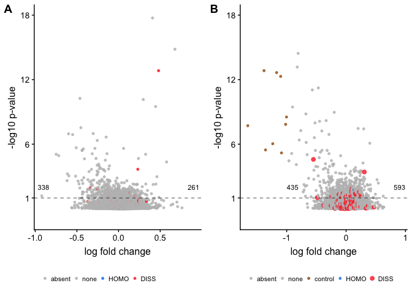

Cho et al 2015 used RNA sequencing to quantify transcript levels in the
mouse hippocampus after contextual fear conditioning. The Cho dataset
provides a snapshot of gene expression changes associated with
hippocampal learning and memory 30 min and 4 h after an experiment. The
Cho data are available at
<http://science.sciencemag.org/content/suppl/2015/09/30/350.6256.82.DC1>
and <https://www.ncbi.nlm.nih.gov/geo/query/acc.cgi?acc=GSE72064>. The
file `../data/aac7368-Cho.SM.Table.S2.xls` of differentially expressed
genes was used as a representative dataset for learning and memory
associated gene expression patterns.

In this analysis, I compared the Cho et al differentially expressed
genes (DEGs) to my experimental results (referred to as the Harris data)
to identify the interaction between genes that are differentially
expressed following fear condition and following a chemical
manipulation.

This analysis prints the list of genes that are differentially expressed
in both experiments. The images show that only a few (red dots) of genes
that respond to chemical dissociation are up-regulated or down-regulated
following fear-conditioning.

[Click here to view the source code.](./08-genelists.Rmd)

The number of differential gene expression in the harris data set and
then the Cho data sets at 4 h and 30 min.

    ##  HOMO  none  DISS 
    ##    11 12008   138

    ##   gene_symbol     logFC    AveExpr         t      P.Value    adj.P.Val
    ## 1       PROX1 13.876409  3.6431261 10.811670 2.600771e-09 7.296508e-07
    ## 2      IGFBP5 10.655410  4.0444132  6.024944 1.062618e-05 4.829865e-04
    ## 3       C1QL2 10.009691  1.0010774 14.536638 2.117321e-11 2.088064e-08
    ## 4         DSP  9.995924  0.8950099 10.403023 4.755595e-09 1.199737e-06
    ## 5      STXBP6  9.664500  3.8723598 11.969999 5.138066e-10 2.039186e-07
    ## 6      MFSD2A  9.315131 -0.6966044 13.533442 6.935708e-11 4.614397e-08
    ##           B
    ## 1 11.551588
    ## 2  3.492611
    ## 3 14.128875
    ## 4 10.111786
    ## 5 13.103359
    ## 6 12.302552

    ##     gene       lfc    log10p       pvalue direction
    ## 1  PROX1 13.876409  8.584898 2.600771e-09        DG
    ## 2 IGFBP5 10.655410  4.973623 1.062618e-05        DG
    ## 3  C1QL2 10.009691 10.674213 2.117321e-11        DG
    ## 4    DSP  9.995924  8.322795 4.755595e-09        DG
    ## 5 STXBP6  9.664500  9.289200 5.138066e-10        DG
    ## 6 MFSD2A  9.315131 10.158909 6.935708e-11        DG

    ### Plotting their data with my differential exprssion

    overlap30min <- overlap(thirtyminRNA) # no DEGs
    overlap4h <- overlap(fourhoursRNA)
    summary(overlap4h$color)

    ##           absent             none          control fear-conditioned 
    ##             1566            11403                9                0 
    ##             HOMO             DISS 
    ##               11              138

    overlap4h %>%
      filter(Cho == "control",
             Harris =="HOMO")  %>%
      select(gene, lfc.x, log10p) %>%
      arrange(gene)

    ## [1] gene   lfc.x  log10p
    ## <0 rows> (or 0-length row.names)

    overlap4h %>%
      filter(Cho == "control",
             Harris =="DISS")  %>%
      select(gene, lfc.x, log10p) %>%
      arrange(gene)

    ## [1] gene   lfc.x  log10p
    ## <0 rows> (or 0-length row.names)

    overlap4h %>%
      filter(Cho == "control")  %>%
      select(gene, lfc.x, log10p) %>%
      arrange(gene)

    ##     gene     lfc.x    log10p
    ## 1   Aqp1 -1.382172 12.836310
    ## 2 Calml4 -1.087474  5.187103
    ## 3  Cldn2 -1.003313  8.527052
    ## 4  Clic6 -1.017852  7.843026
    ## 5  Folr1 -1.102123 12.302898
    ## 6  Kcne2 -1.169621 12.652911
    ## 7 Slc4a5 -1.235330  6.039947
    ## 8 Tmem72 -1.654890  7.715675
    ## 9    Ttr -1.356586  5.464636

