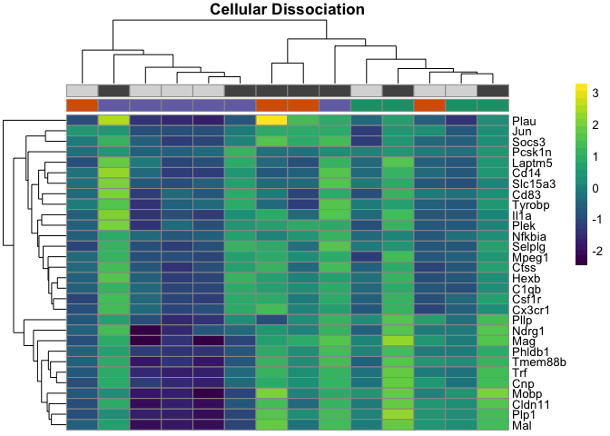

Here is the function I wrote to make two heatmaps, one a png and one a
pdf. The goal is to have the ~ top 20 genes that are differentially
expressed according to treatment.

    Heatmaps <- function(DEGes, ann_colors, df, main){
      
        myfile <-  paste("../figures/heatmaps/", substitute(DEGes), ".pdf", sep="")
      
      DEGes <- DEGes[order(DEGes$padjmin),]
      DEGes <- head(DEGes, 20)
      head(DEGes, 20)

     rownames(DEGes) <- DEGes$rownames
    drop.cols <-colnames(DEGes[,grep("padj|pval|rownames", colnames(DEGes))])
    DEGes <- DEGes %>% select(-one_of(drop.cols))
    DEGes <- as.matrix(DEGes)
    DEGes <- DEGes - rowMeans(DEGes)

      paletteLength <- 30
      myBreaks <- c(seq(min(DEGes), 0, length.out=ceiling(paletteLength/2) + 1), 
                  seq(max(DEGes)/paletteLength, max(DEGes), length.out=floor(paletteLength/2)))
      
    pheatmap(DEGes, show_colnames=F, show_rownames = T,
             annotation_col=df, annotation_colors = ann_colors, 
             annotation_row = NA, annotation_legend = FALSE,
             annotation_names_row = FALSE, annotation_names_col = FALSE,
             border_color = "grey60" ,
             color = viridis(30),
             clustering_method="average",
             breaks=myBreaks,
             clustering_distance_cols="correlation",
             main = main)  

    pheatmap(DEGes, show_colnames=F, show_rownames = T,
             annotation_col=df, annotation_colors = ann_colors, 
             annotation_row = NA, annotation_legend = FALSE,
             annotation_names_row = FALSE, annotation_names_col = FALSE,
             treeheight_row = 0, treeheight_col = 10,
             fontsize = 7, 
             border_color = "grey60" ,
             color = viridis(30),
             width=2.5, height=3.25,
             clustering_method="average",
             breaks=myBreaks,
             clustering_distance_cols="correlation", 
             main = main,
             filename =  myfile)
    }

    cembrowski_DEGes <- read.csv("../results/04_cembrowksi_DEGes.csv", header = T)
    cembrowski_df <- read.csv("../results/04_cembrowksi_colData.csv", header = T, row.names = 1)

    dissocation_DEGes <- read.csv("../results/01_dissociation_DEGes.csv", header = T, check.names = F)
    dissocation_df <-read.csv("../results/01_dissociation_colData.csv", header = T, row.names = 1)
    dissocation_df <- dissocation_df %>% dplyr::select(Subfield, Treatment)

    stress_DEGes <- read.csv("../results/02_stress_DEGes.csv", header = T, check.names = F)
    stress_df <-read.csv("../results/02_stress_colData.csv", header = T, row.names = 1)
    stress_df <- stress_df %>% dplyr::select(Subfield, Treatment)

    cognition_DEGes <- read.csv("../results/03_cognition_DEGes.csv", header = T, check.names = F)
    head(cognition_DEGes)

    ##   142C_CA1  142C_DG 143C_CA1  143C_DG 143C-CA1-1 143D-CA1-3 143D-DG-3
    ## 1 5.713463 5.584278 4.922582 4.639157   5.306996   5.747738  6.180052
    ## 2 4.309530 3.818558 3.761887 3.637877   3.975931   2.829003  3.014468
    ## 3 1.390583 1.395158 1.589651 1.397381   1.606880   1.450711  1.762254
    ## 4 5.816586 5.879017 5.712716 5.940120   6.082035   5.665536  6.079904
    ## 5 5.759694 6.186495 6.629910 6.255837   5.886921   6.280794  6.761346
    ## 6 3.651520 3.377276 4.200391 4.114734   4.294131   4.829222  4.322305
    ##   144C-CA1-2 144C-CA3-2 144C-DG-2 144D-CA3-2 144D-DG-2 146C-CA1-4
    ## 1   5.413456   5.702022  5.551916   5.482276  5.919441   5.885949
    ## 2   3.547391   4.698298  3.839243   3.742125  3.561186   3.672334
    ## 3   1.541166   1.992772  1.891378   2.088004  1.895524   2.337347
    ## 4   5.817095   6.322157  6.184617   5.587339  5.959630   5.704570
    ## 5   6.008565   6.706203  6.471771   6.704305  5.993897   6.137248
    ## 6   4.382091   4.437217  4.313277   4.089548  4.462278   3.824282
    ##   146C-DG-4 146D-CA1-3 146D-CA3-3 146D-DG-3 147C-CA1-3 147C-CA3-3
    ## 1  6.293134   5.945267   5.930499  6.644680   5.591870   5.973203
    ## 2  4.182742   3.949450   3.939498  3.496008   3.674971   3.707386
    ## 3  1.505610   1.541872   1.868368  1.783622   1.552494   1.821320
    ## 4  5.524345   4.465793   5.912389  6.029632   5.440758   6.175723
    ## 5  6.919055   6.061658   6.705073  6.013218   6.618547   6.942314
    ## 6  4.241232   5.122992   3.526158  3.742123   4.613809   3.871619
    ##   147C-DG-3 147D-CA3-1 147D-DG-1 pvalTreatmenttrainedyoked
    ## 1  5.360717   5.384883  5.672501                0.36981205
    ## 2  3.985429   4.068637  3.964147                0.21930286
    ## 3  1.550179   1.816229  2.224676                0.26692575
    ## 4  6.010819   5.532228  5.937791                0.14667346
    ## 5  6.417178   6.701450  6.250783                0.89902270
    ## 6  3.864790   2.538419  4.545623                0.09044817
    ##   padjTreatmenttrainedyoked      rownames   padjmin
    ## 1                 0.6285209 0610007P14Rik 0.6285209
    ## 2                 0.4737998 0610009B22Rik 0.4737998
    ## 3                        NA 0610009L18Rik        NA
    ## 4                 0.3816417 0610009O20Rik 0.3816417
    ## 5                 0.9578430 0610010F05Rik 0.9578430
    ## 6                 0.2938167 0610010K14Rik 0.2938167

    cognition_df <-read.csv("../results/03_cognition_colData.csv", header = T, row.names = 1)
    cognition_df <- cognition_df %>% dplyr::select(Subfield, Treatment)

    Heatmaps(cembrowski_DEGes, cembrowksi_colors, cembrowski_df, "Dorsal Ventral Gradient")

    Heatmaps(dissocation_DEGes, dissocation_colors, dissocation_df, "Cellular Dissociation")

    Heatmaps(stress_DEGes, stress_colors, stress_df, "Stressful Enviornment")

    Heatmaps(cognition_DEGes, cognition_colors, cognition_df, "Cognitive Training")

